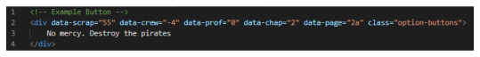
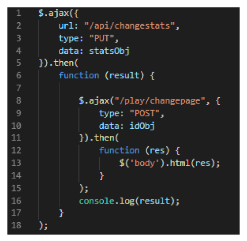

# Orion Trail  

Orion Trail is a 'choose your own adventure' style story game with RPG elements. Raise your Crew, Scrap, and Proficiency stats through the choices you make - ultimately deciding your fate.  

## Story  

During a routine space flight, you and your crew discover an uncharted wormhole. Despite best effots you can't fight the extreme gravitational pull and you find yourself hurling through the unknown. Spit out the other end in tact and utterly lost, you must find your way home to the Orion constellation.  

## Gameplay  

#### Stats  

There are three different stats in Orion Trail, and your goal is to raise one or all of your stats as high as possible so you may top the leaderboard.  

Stats:
* Crew - The number of crew members you have. Increased or decreased through actions that may injure or add to your crew.
* Scrap - The currecy of the universe. Your supplies and resources. Increased or decreased through economic actions.
* Proficiency - How skilled you are. Mastery over the situation. Increased or decreased through masterful (or terrible) decisions.  

#### Choices  

  

Here is an example of a choice you may have to make. The choices you make both progress you through the dynamic story and change your stats. Careful, there's no going back!  

#### Find your way home or die tyring!  

## Code  

#### Technology used  

* jQuery
* handlebars template language
* MySQL
* ORM file structure
* Node.js with express
* Custom CSS
* Scrolling credits library  

#### Code functionality

We designed this system to be modular; To add more story, you simply add a handlebars file, update the text, and create button choices with five distinct data attributes:  

  

The first three attributes (crew, scrap, prof) will change the player's stats relative to their value. The last two attributes (chap, page) will forward the player to that page. From a button click we can gather these values and send them into two simple ajax calls (changestats, changepage):  

 

From there, we only need one route to handle all stat changes, and one route to handle all page changes!